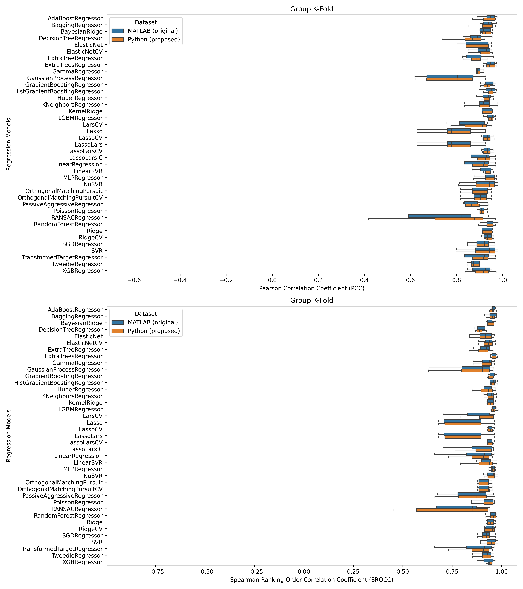

<h1 align="center">
  pointpca2-python
</h1>

#### Cross-language replication and analysis of "pointpca2" using MATLAB and Python.

This project focuses on the adaptation of the [pointpca2](https://github.com/cwi-dis/pointpca2/) project (2023 Grand Challenge on Objective Quality Metrics for Volumetric Contents), written in MATLAB, into Python, aiming to replicate its functionality in a different programming ecosystem. The primary objective is to ensure that features generated from both environments are comparable and can be used interchangeably for further analysis. Upon successful replication, the project will proceed to utilize these features for regression analysis against a dataset's subjective scores. A comprehensive comparison of the performance of regressors, facilitated through Pearson and Spearman correlation coefficients, will be carried out for each version of the code. Furthermore, a statistical t-test will be conducted to rigorously compare the correlation results derived from both MATLAB and Python implementations, ensuring the validity and reliability of the adaptation process.

## Key Objectives
1. Code Adaptation: Convert the "pointpca2" project code from MATLAB to Python, ensuring that the core functionality and output remain consistent across both languages.
2. Feature Generation: Generate PCA features using both the original MATLAB code and the newly developed Python code. We will validate the equivalence of these features through statistical methods to ensure that both implementations produce comparable results.
3. Regression Analysis: Use the generated features to perform regression analysis against subjective scores in the dataset. This will involve using a set of regression models and fitting them with the features to predict the subjective scores. Calculate both Pearson and Spearman correlation coefficients for each regressor.
4. Correlation Analysis: Plot the correlation coefficients for each regressor. This analysis will provide insights into the linear and rank-order relationships between predicted scores and actual subjective scores.
5. Statistical Comparison: Conduct a t-test to statistically compare the correlation coefficients obtained from MATLAB and Python implementations. This step is critical to assess whether the differences in correlations (if any) are statistically significant, providing a quantitative measure of the adaptation's fidelity.

## Expected Outcomes
- A fully functional Python version of the "pointpca2" MATLAB project, verified for accuracy and equivalence.
- A detailed comparison of regression model performances using PCA features from both MATLAB and Python implementations.
- A statistical analysis report providing evidence on the equivalence (or differences) in correlation coefficients derived from both languages' codes.

## Prerequisites
- MATLAB (version R2023a tested)
- MATLAB Engine for Python (https://pypi.org/project/matlabengine/)
- anaconda3 (https://www.anaconda.com/)

## Installing
```bash
# Clone and cd into the repository
git clone https://github.com/akaTsunemori/pointpca2-python.git
cd pointpca2-python

# Setup the conda environment
conda env update --file environment.yml

# Activate the new env
conda activate pointpca2-python
```

## Usage
- #### pointpca2.py
This is the project's main module. It replicates all the functions present in pointpca2's original code.
The main function, lc_pointpca, should be called with the paths for the reference and test point clouds, it returns an array consisting of the generated features.
- #### build_tables.py
This module builds the tables with the features from both the MATLAB and Python versions of pointpca2. It has a checkpoint system in order to save progress.
- #### regressions.py
This module uses the tables generated by *build_tables.py* and makes regressions using all available models from LazyPredict. The training/testing for these regressors will use two techniques: Leave One Group Out and Group K-Fold.
- #### plots.py
This module uses the tables generated by *regressions.py* and plots the Pearson and Spearman correlation coefficients for each regressor.
- #### ttests.py
This module uses the tables generated by *regressions.py* and conduces a t-test in order to statistically compare the correlation coefficients from the regression from the tables corresponding to the results of the MATLAB and Python codes, in order to provide a quantitative measure of the adaptation's fidelity.

## Results
The results for a number of datasets are stored in the [results](results) folder. Each folder contains the final checkpoints, cleaned feature tables, plots, regressions, and t-tests. Below are the results for the APSIPA dataset.

- #### Leave One Group Out
<a href="https://github.com/akaTsunemori/pointpca2-python/blob/main/results/APSIPA/plots/APSIPA_LeaveOneGroupOut.png"></a>

[APSIPA_LeaveOneGroupOut_ttests.csv](https://github.com/akaTsunemori/pointpca2-python/blob/main/results/APSIPA/ttests/APSIPA_LeaveOneGroupOut_ttests.csv)

- #### Group K-Fold
<a href="https://github.com/akaTsunemori/pointpca2-python/blob/main/results/APSIPA/plots/APSIPA_GroupKFold.png"></a>

[APSIPA_GroupKFold_ttests.csv](https://github.com/akaTsunemori/pointpca2-python/blob/main/results/APSIPA/ttests/APSIPA_GroupKFold_ttests.csv)

## Acknowledgments
- [pointpca2](https://github.com/cwi-dis/pointpca2/)

## License
Licensed under the BSD 3-Clause Clear License

---

> GitHub [@akaTsunemori](https://github.com/akaTsunemori)
